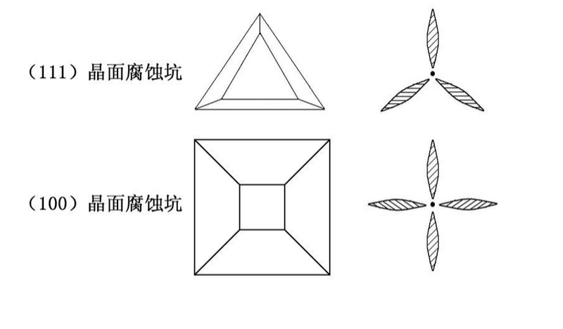

# 半导体器件实验

## 实验一：光图法单晶定向

1. 掌握硅单晶样品的镜像与光图关系


```
    硅单晶结构所具有宏观对称性，把单晶晶面进行研磨、腐蚀，使晶面出现与晶片有一定对应关系的小腐蚀抗。再利用这些小腐蚀抗的宏观对称性，由正入射的平行光可反映出不同的光象。来确定与之对应的晶向。 
    

    硅锗或砷化镓表面经研磨和化学腐蚀处理以后，会出现大量的腐蚀坑。这些腐蚀坑主要以低指数晶面为界壁，也正是这些低指数晶面决定了腐蚀坑的形状。由于各晶向的对称性不同，腐蚀坑的形状也不相同，因此称之为特征腐蚀坑。如（111）上的腐蚀坑是正三角形或六角形，（100）上的腐蚀坑是正方形，（110）上的腐蚀坑是长方形。当晶体表面偏离上述这三个晶面时，腐蚀坑的形状也相应的偏斜。当一束平行可见光（如He-Ne激光束，波长=6328A）照射到经研磨和化学腐蚀后的表面时，特征腐蚀坑的界壁就会反射光束，并在屏幕上形成发射花样——光象图。光象图的对称性反映了晶体的对称性。硅单晶的光象图如下图： 
```



2. 掌握确定硅单晶晶相的方法

```
    实验仪器：氦氖激光器、光屏、待测样品、水浴箱、烧杯、玻璃板、研磨料、NaOH等

    实验步骤：
    1、研磨样品：将单晶棒切割，用300#金刚砂研磨平光；
    2、腐蚀：将研磨好的样品放入到盛有NaOH(5%)的溶液中腐蚀5分钟，水浴箱的温度控制在70~90oC，单晶棒截面将腐蚀出很小的位错腐蚀坑。由于不同的晶面其结构各不相同。腐蚀后不同的晶向有不同的位错腐蚀抗，对应不同的光图。
    3、打开激光器，调好光屏，用样品打平行光观察其对应光像。 
```

3. 拿坐标纸画出相应节里面的图（使用坐标纸）

```
    在该实验中观察到样品出现清晰、对称的三叶状结构的光图，因此确定被测样品的晶向是<111>晶向。
    了解了光图法确定单晶晶向的实验方法以及半导体内部原子之间的排列情况，与所学的微电子工艺相连系，知道了不同的晶向进行扩散时速度不同的主要原因，是因为不同的晶向的原子排列的密度不同。
```

## 实验二：晶体管参数测试

1. 掌握常用晶体管特性及原理
2. 掌握hfe下坐标是F-hf的测量及求解方法

## 实验三：预习报告
 
1. 理解常用晶体管特性及原理

    选一种三极管和二极管的型号，描述一下它的特性及原理
    
2. 晶闸管特性及原理